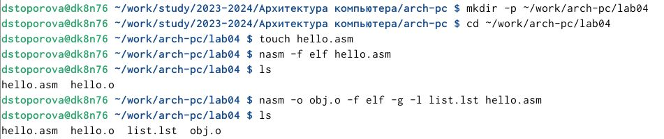
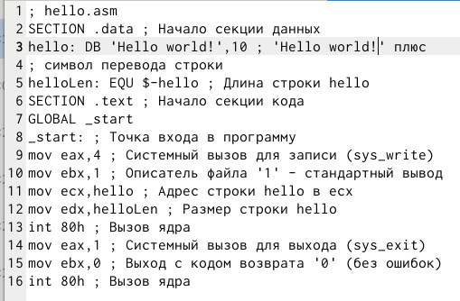
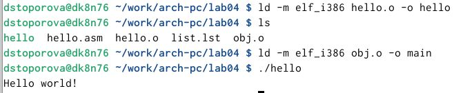
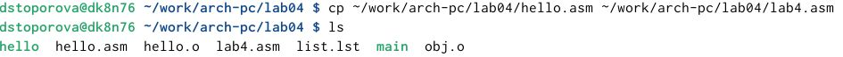
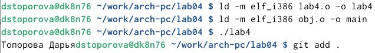
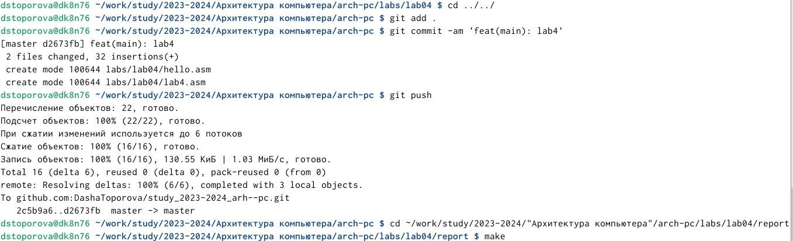

---
## Front matter
title: "Лабораторная работа №4"
subtitle: "Архитектура компьютеров НММбд-03-24"
author: "Топорова Дарья Сергеевна"

## Generic otions
lang: ru-RU
toc-title: "Содержание"

## Bibliography
bibliography: bib/cite.bib
csl: pandoc/csl/gost-r-7-0-5-2008-numeric.csl

## Pdf output format
toc: true # Table of contents
toc-depth: 2
lof: true # List of figures
lot: true # List of tables
fontsize: 12pt
linestretch: 1.5
papersize: a4
documentclass: scrreprt
## I18n polyglossia
polyglossia-lang:
  name: russian
  options:
	- spelling=modern
	- babelshorthands=true
polyglossia-otherlangs:
  name: english
## I18n babel
babel-lang: russian
babel-otherlangs: english
## Fonts
mainfont: IBM Plex Serif
romanfont: IBM Plex Serif
sansfont: IBM Plex Sans
monofont: IBM Plex Mono
mathfont: STIX Two Math
mainfontoptions: Ligatures=Common,Ligatures=TeX,Scale=0.94
romanfontoptions: Ligatures=Common,Ligatures=TeX,Scale=0.94
sansfontoptions: Ligatures=Common,Ligatures=TeX,Scale=MatchLowercase,Scale=0.94
monofontoptions: Scale=MatchLowercase,Scale=0.94,FakeStretch=0.9
mathfontoptions:
## Biblatex
biblatex: true
biblio-style: "gost-numeric"
biblatexoptions:
  - parentracker=true
  - backend=biber
  - hyperref=auto
  - language=auto
  - autolang=other*
  - citestyle=gost-numeric
## Pandoc-crossref LaTeX customization
figureTitle: "Рис."
tableTitle: "Таблица"
listingTitle: "Листинг"
lofTitle: "Список иллюстраций"
lotTitle: "Список таблиц"
lolTitle: "Листинги"
## Misc options
indent: true
header-includes:
  - \usepackage{indentfirst}
  - \usepackage{float} # keep figures where there are in the text
  - \floatplacement{figure}{H} # keep figures where there are in the text
---

# Цель работы

Освоение процедуры компиляции и сборки программ, написанных на ассемблере NASM.

# Задание
 
1.установка нужного ПО
2.научиться работать с языком Асемблера
3.выполнение самостоятельной работы

# Выполнение лабораторной работы

1.1 создаём нужные для работы файлы и каталог, где они будут находиться (рис.1.1 [-@fig:001]).

{#fig:001 width=70%}

1.2 в файл hello.asm вводим данный нам текст (рис.1.2 [-@fig:001]).

{#fig:001 width=70%}

1.3 чтобы получить исполняемую программу, объектный файл
необходимо передать на обработку компоновщику. С помощью ключа -o с последующим значением задаём в данном случае имя создаваемого исполняе-
мого файла и запускаем наш файл (рис.1.3 [-@fig:001]).

{#fig:001 width=70%}

# Выполнение самостоятельной работы

2.1 копируем файл hello.asm и переименовываем в lab4.asm(рис.2.1 [-@fig:001]).
 
{#fig:001 width=70%}

2.2 Также как и с файлом hello.asm перед запуском нам нужно обработать новый файл (lab4.asm) (рис.2.2 [-@fig:001]).

{#fig:001 width=70%}

2.3 отправляем все изменения на github, с помощью изученных ранее команд (рис.2.3 [-@fig:001]).

{#fig:001 width=70%}

# Выводы

В течение выполнения данной работы я освоила процедуры компиляции и сборки программ, написанных на ассемблере NASM.

