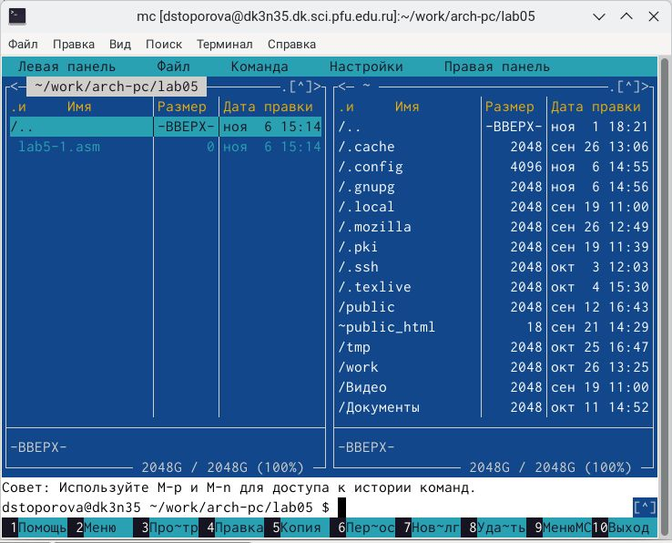

---
## Front matter
title: "Лабораторная работа №5"
subtitle: "Архитектура компьютеров НММбд-03-24"
author: "Топорова Дарья Сергеевна"

## Generic otions
lang: ru-RU
toc-title: "Содержание"

## Bibliography
bibliography: bib/cite.bib
csl: pandoc/csl/gost-r-7-0-5-2008-numeric.csl

## Pdf output format
toc: true # Table of contents
toc-depth: 2
lof: true # List of figures
lot: true # List of tables
fontsize: 12pt
linestretch: 1.5
papersize: a4
documentclass: scrreprt
## I18n polyglossia
polyglossia-lang:
  name: russian
  options:
	- spelling=modern
	- babelshorthands=true
polyglossia-otherlangs:
  name: english
## I18n babel
babel-lang: russian
babel-otherlangs: english
## Fonts
mainfont: IBM Plex Serif
romanfont: IBM Plex Serif
sansfont: IBM Plex Sans
monofont: IBM Plex Mono
mathfont: STIX Two Math
mainfontoptions: Ligatures=Common,Ligatures=TeX,Scale=0.94
romanfontoptions: Ligatures=Common,Ligatures=TeX,Scale=0.94
sansfontoptions: Ligatures=Common,Ligatures=TeX,Scale=MatchLowercase,Scale=0.94
monofontoptions: Scale=MatchLowercase,Scale=0.94,FakeStretch=0.9
mathfontoptions:
## Biblatex
biblatex: true
biblio-style: "gost-numeric"
biblatexoptions:
  - parentracker=true
  - backend=biber
  - hyperref=auto
  - language=auto
  - autolang=other*
  - citestyle=gost-numeric
## Pandoc-crossref LaTeX customization
figureTitle: "Рис."
tableTitle: "Таблица"
listingTitle: "Листинг"
lofTitle: "Список иллюстраций"
lotTitle: "Список таблиц"
lolTitle: "Листинги"
## Misc options
indent: true
header-includes:
  - \usepackage{indentfirst}
  - \usepackage{float} # keep figures where there are in the text
  - \floatplacement{figure}{H} # keep figures where there are in the text
---

# Цель работы

Приобретение практических навыков работы в Midnight
Commander. Освоение инструкций языка ассемблера mov и int.

# Задание
 
1.Научиться работать в Midnight Commander и освоение языка
ассемблера
2. Задание для самостоятельной работы

# Выполнение лабораторной работы

1.1  Открываем Midnight Commander с помощью команды mc. Клавишей F7
создаём нужный каталог lab05 и в нём файл lab5-1.asm (командой touch) (рис.1.1 [-@fig:001]).

{#fig:001 width=70%}

1.2 Клавишей F4 откроем файл lab5-1.asm для редактирования во
встроенном редакторе. Введём текст программы из данного нам листинга. (рис.1.2 [-@fig:001]).

{#fig:001 width=70%}

1.3 Транслируем текст программы lab5-1.asm в объектный файл.
Выполняем компоновку объектного файла и запустим получившийся
исполняемый файл. (рис.1.3 [-@fig:001]).

{#fig:001 width=70%}

1.4 Для упрощения написания программ скачаем файл in_out.asm (файл с
готовыми подпрограммами) со страницы курса в ТУИС. Перемещаем файл
в каталог с программами. (рис.1.4 [-@fig:001]).

{#fig:001 width=70%}

1.5 С помощью функциональной клавиши F6 создаём копию файла
lab5-1.asm с именем lab5-2.asm (рис.1.5 [-@fig:001]).

{#fig:001 width=70%}

1.6 Переписываем часть текста программы в файле lab5-2.asm с
использованием подпрограмм из внешнего файла in_out.asm в
соответствии со вторым листингом.(рис.1.6 [-@fig:001]).

{#fig:001 width=70%}

1.7.1 Создаём исполняемый файл и проверяем его работу..(рис.1.7.1 [-@fig:001]).

{#fig:001 width=70%}

1.7.2. Если изменим подпрограмму sprintLF на sprint, то ввод с клавиатуры
будет осуществляться не со следующей строки, а на той же.(рис.1.7.2 [-@fig:001]).

{#fig:001 width=70%}

# Выполнение самостоятельной работы

2.1 Создаём копию файла lab5-2.asm и переименовываем в lab5-3.asm.
Редактируем программу, чтобы файл выводил введённую строку на экран(рис.2.1 [-@fig:001]).

{#fig:001 width=70%}

2.2 Снова создаём исполняемый файл и проверяем его работу(рис.2.2 [-@fig:001]).

{#fig:001 width=70%}

2.3 Создаём копию файла lab5-1.asm и переименовываем в lab5-4.asm.
Делаем те же самые действия, что и с lab5-3.asm(рис.2.3.1 [-@fig:001]) (рис.2.3.2 [-@fig:001]).

{#fig:001 width=70%}

{#fig:001 width=70%}

# Выводы

Я приобрела практические навыков работы в Midnight
Commander. Освоила инструкции языка ассемблера mov и int.

